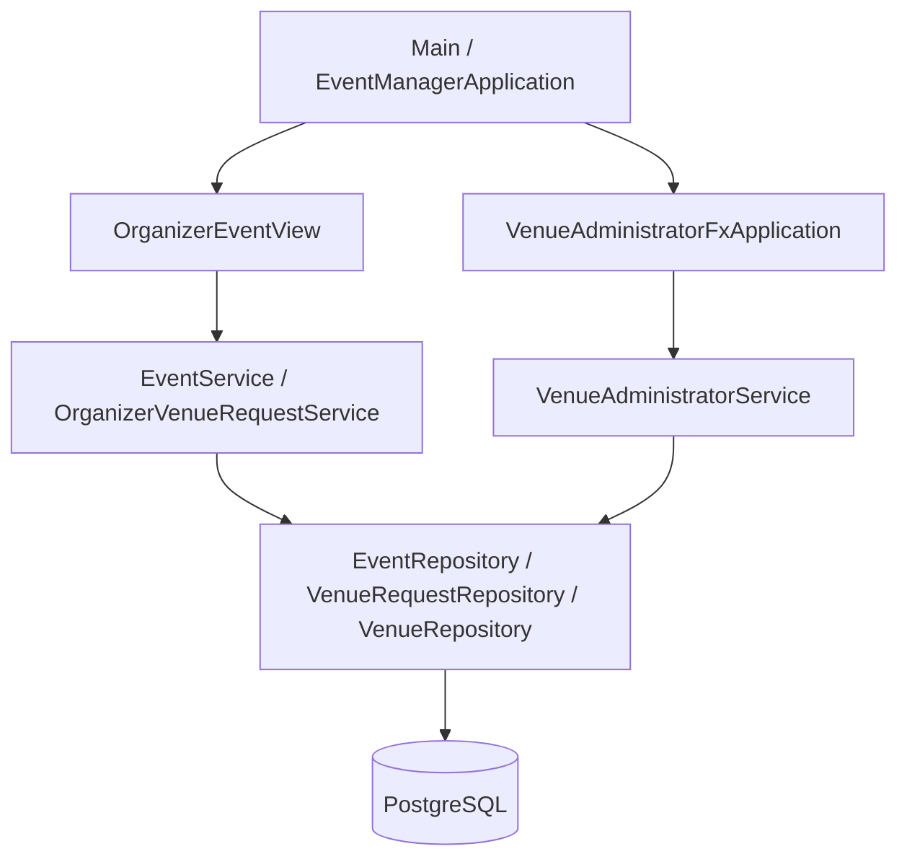
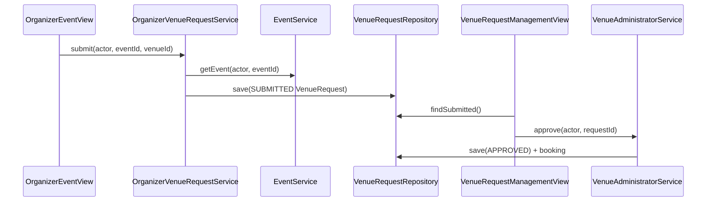

# Event Venue Manager Developer Guide

---

## Acknowledgements

Event Venue Manager is a CS3227 MP2 team project (Club Organizer, Venue Administrator, Attendee).

Libraries and resources used include:

1. [JavaFX](https://openjfx.io/)
2. [JUnit 5](https://junit.org/junit5/)
3. [PostgreSQL](https://www.postgresql.org/) / JDBC
4. [Flyway](https://flywaydb.org/)
5. [dotenv-java](https://github.com/cdimascio/dotenv-java) (local `.env` loading)
6. Gradle Wrapper for builds

Agentic SE process notes and skills live under [`AGENTS.md`](../AGENTS.md) and [Agentic SE](AgenticSE.md). Interaction-log format adapts Johannsen’s MP1 development-record practice; **no MP1 application code** was reused.

The Attendee catalogue was developed with Codex using the repository's TDD,
review and desktop UI skills. The bundled PostgreSQL best-practices skill informed
the query/index review; no additional database library or external SQL sample was
copied into the implementation.

---

## Setting up, getting started

1. Install **JDK 25** and a local **PostgreSQL** instance.
2. Clone the repository and create a project-root `.env` (see [User Guide — Getting Started](UserGuide.md#getting-started)).
3. From the project root:

   ```sh
   ./gradlew test
   ./gradlew run
   ```

4. Prefer feature branches; keep role-specific UI separate while sharing persistence and auth boundaries.

> **Note:** Club Organizer and Venue Administrator share one database when `DATABASE_*` / `EVENT_MANAGER_DB_*` point at the same URL. That is configuration compatibility, not unified authentication.

---

## Design

### Architecture



**Main components**

| Component | Responsibility |
| --- | --- |
| **UI** | JavaFX role workspaces (`ui` package). Presentation only; no business-rule ownership. |
| **Application / service** | Workflows such as `EventService`, `OrganizerVenueRequestService`, `VenueAdministratorService`. |
| **Domain** | Types under `event`, `venue`, `common` (e.g. `Event`, `VenueRequest`, `Actor`). |
| **Storage** | JDBC repositories, Flyway migrations, organizer SQL migrations, `.env` bootstrap. |

**How components interact (venue request happy path)**



### UI component

**Location:** `seedu.eventmanager.ui`

* `EventManagerApplication` — home screen and role routing.
* `OrganizerEventView` — create/edit events and **Request venue**.
* `VenueAdministratorFxApplication` — login, dashboard, venues, requests, users/access.
* `VenueAdministratorDashboardController` + `VenueAdministratorApiClient` — presentation state without duplicating Admin business rules.

The Organizer and Admin shells share visual tokens (sidebar `#172033`, page `#f7f9fc`, primary actions `#2563eb`).

### Application / logic component

**Organizer**

* `EventService` — create/list/get/edit draft events; club ownership checks; optimistic versioning.
* `OrganizerVenueRequestService` — builds Jordan’s `VenueRequest` as `SUBMITTED` (UTC window, attendance = capacity).
* `OrganizerIds` — transitional `String` → `UUID` mapping for `organizer_id`.

**Venue Administrator**

* `VenueAdministratorService` — approve/reject with authorization, conflict check on approve, audit + notification outbox.
* `AuthorizationService` / `JdbcAuthorizationService` — role + `venue_administrator_venues` scope.

### Model / domain component

* `event.Event`, `EventDetails`, `EventStatus`, `OrganizerIdentity`
* `venue.Venue`, `VenueRequest`, `VenueRequestStatus`, `VenueRequestValidator`
* `common.Actor`, `Role`, shared exceptions

Domain types do not depend on JavaFX.

### Storage component

* Organizer tables via `DatabaseMigration` / `db/organizer` resources (outside Flyway version stream).
* Venue Admin schema via Flyway under `src/main/resources/db/migration` (`baselineOnMigrate` at `0`).
* JDBC repositories: `JdbcEventRepository`, `JdbcVenueRequestRepository`, `JdbcVenueRepository`, etc.
* Config: `DatabaseBootstrap` reads `DATABASE_*` then falls back to `EVENT_MANAGER_DB_*`.

### Common classes

Shared utilities and cross-cutting types live under `seedu.eventmanager.common` (exceptions, roles, actors, logging helpers).

---

## Implementation

### Create and edit draft events

**Problem:** Organizers need to persist draft events with ownership and validation.

**Approach:**

1. UI collects form fields → `EventFormParser` → `EventDetails`.
2. `EventService.createEvent` / `editEvent` validates title, interval, capacity, and club ownership.
3. `EventRepository` persists event + business audit in one transaction.

**Key classes:** `EventService`, `JdbcEventRepository`, `OrganizerEventView`.

### Request venues (Organizer → Admin pipeline)

**Problem:** Organizer events must enter the Admin approve/reject queue.

**Approach:**

1. `OrganizerVenueRequestService.submit` loads the owned event, requires an ACTIVE venue, rejects duplicate open requests.
2. Persists `VenueRequest` with `status = SUBMITTED` through `VenueRequestRepository`.
3. Admin UI loads pending rows via `findSubmitted()`; `VenueAdministratorService.approve` / `reject` decides them.
4. Creating a venue (or **Claim access**) grants `venue_administrator_venues` so Approve is authorized.
5. Navigating to **Venue requests** calls `controller.load()` so the list is not stale.

**Key classes:** `OrganizerVenueRequestService`, `OrganizerIds`, `JdbcVenueRequestRepository`, `VenueAdministratorService`, `VenueAdministratorFxApplication`, `VenueManagementView`.

**Design notes / merge debt:**

* Organizer identity remains env-based until shared users auth.
* Conflict detection remains on Admin approve (not on Organizer submit).
* No supersede/withdraw in v1.

### Attendee catalogue (first slice)

`EventCatalogueService` exposes a public read-only projection of the canonical
Organizer events. Its `EventCatalogueRepository` boundary has a JDBC adapter in
`storage`; it does not bypass organizer ownership checks for writes or introduce
an attendee event table. SQL restricts reads to published events; the service
also enforces future-start visibility for both listing and direct-ID details.
`CatalogueEvent` omits organizer identity and internal version/state fields.

`CatalogueQuery` combines literal, case-insensitive title/description search,
exact club ID and inclusive Singapore-calendar start dates. An injected clock
defines "upcoming". `AttendeeBrowseView` uses cancellable JavaFX Tasks on virtual
threads and ignores superseded results. Database/configuration work is off the
UI thread; Home/app shutdown cancels pending work. Failures use safe messages and
structured failure-type logging, not raw JDBC messages or business audit writes.

The Attendee route does not run migrations or create fixtures. Organizer schema
initialization remains with the existing bootstrap. Publication is not currently
implemented by `EventService`, so new drafts do not appear. Venue data, available
seats, personalized records and mutations are intentionally not claimed by this
slice. After integrating shared authentication PR #22, the desktop catalogue is
routed from an ATTENDEE login; its read service still exposes only public event
fields. See [the Attendee plan](AttendeePlan.md).

Focused verification:

```sh
./gradlew test --tests 'seedu.eventmanager.attendee.*'
./gradlew attendeeUiSmoke
```

The three real PostgreSQL catalogue tests require `EVENT_MANAGER_TEST_DB_URL`,
`EVENT_MANAGER_TEST_DB_USER` and optionally `EVENT_MANAGER_TEST_DB_PASSWORD`.
Use a disposable test database, never the application database. Each new catalogue
test creates and drops its own randomized schema; other existing integration
tests may truncate their test tables. CI explicitly supplies the database settings
for the Attendee test step. Without them, these database tests are skipped, not
verified. Six service tests run without PostgreSQL.

`attendeeUiSmoke` is opt-in and requires a graphical desktop. It opens the actual
JavaFX browse view with an in-memory synthetic repository, checks search/details,
empty/validation/error/retry/Home behavior and saves snapshots under
`build/attendee-smoke/`. This is real UI interaction with fixture data, not
database-connected or cross-role E2E coverage. It is not run in headless CI.

Historical verification before this main sync: on the inspected local SGT environment, the two
existing `PostgreSqlVenueAdministratorIntegrationTest` cases fail because record
equality distinguishes `+08:00` from equivalent UTC offsets returned by JDBC.
At that revision, the full suite passed with `JAVA_TOOL_OPTIONS=-Duser.timezone=UTC`; this is a
diagnostic environment setting, not a fix for those tests or a global app change.
The catalogue's Instant/SGT conversion tests pass in the normal local environment.
The initial catalogue fetches upcoming published events then filters text/club/date
in memory. Large-data pagination and a publication-specific index need a measured,
coordinated follow-up; no existing migration was modified or performance claim made.

### Team ownership

| Role | Owns |
| --- | --- |
| Club Organizer (Joseph) | Events, volunteers/announcements (as scheduled), Organizer→venue submit |
| Venue Administrator (Jordan) | Venues, availability, request decide, bookings, Admin UI |
| Attendee (Johannsen) | Read-only discovery; registration and check-in remain planned |

---

## Documentation, logging, testing, configuration

### Documentation

Update [UserGuide.md](UserGuide.md) and this Developer Guide when behaviour changes. Keep Agentic SE notes in [AgenticSE.md](AgenticSE.md).

### Logging and interaction records

* Business audit records (e.g. venue decisions) are distinct from diagnostic logs.
* Meaningful agent tasks are recorded under `logs/<contributor>/` using [logs/templates/interaction.md](../logs/templates/interaction.md).
* Summaries: [logs/prompts_summary.md](../logs/prompts_summary.md).

### Testing

| Level | Examples | What it proves |
| --- | --- | --- |
| Unit | `EventServiceTest`, `OrganizerVenueRequestServiceTest`, `OrganizerIdsTest`, `VenueRequestValidatorTest` | Domain rules with fakes |
| In-process pipeline / E2E (no JavaFX) | `OrganizerToAdminVenuePipelineE2ETest`, `VenueAdministratorWorkflowE2ETest` | Submit → pending → approve wiring |
| Optional Postgres | `PostgreSqlVenueAdministratorIntegrationTest` (env `DATABASE_INTEGRATION_TESTS=true`) | Real JDBC for Admin persistence |
| Manual UI | See [Appendix: Instructions for manual testing](#appendix-instructions-for-manual-testing) | Desktop flows |

Run:

```sh
./gradlew test
```

Focused Organizer request tests:

```sh
./gradlew test --tests 'seedu.eventmanager.event.OrganizerVenueRequestServiceTest' --tests 'seedu.eventmanager.e2e.OrganizerToAdminVenuePipelineE2ETest'
```

### Configuration

| Variable | Purpose |
| --- | --- |
| `DATABASE_URL` / `EVENT_MANAGER_DB_URL` | JDBC URL |
| `DATABASE_USER` / `EVENT_MANAGER_DB_USER` | DB user |
| `DATABASE_PASSWORD` / `EVENT_MANAGER_DB_PASSWORD` | Optional password |
| `EVENT_MANAGER_ORGANIZER_ID` | Organizer string identity |
| `EVENT_MANAGER_CLUB_IDS` | Comma-separated club ids |

### Agentic SE workflow

Project instructions: [`AGENTS.md`](../AGENTS.md). Skills under `.agents/skills/`:

* requirements-and-acceptance
* test-driven-implementation
* code-review-and-verification
* desktop-ui-polish

See [Agentic SE](AgenticSE.md). Cursor project hooks (optional process guardrails): [hook-design.md](hook-design.md).

---

## Appendix: Requirements

### Product scope

**Target users:** Campus club organizers and venue administrators coordinating events and room bookings.

**Value:** One desktop app with role workspaces over a shared database so Organizer drafts can enter the Admin venue pipeline.

### User stories (selected)

| Priority | As a… | I want to… | So that… |
| --- | --- | --- | --- |
| High | Club Organizer | create and edit draft events | I can plan club activities |
| High | Club Organizer | request a venue for an event | Admin can approve a booking |
| High | Venue Administrator | see submitted requests | I can approve or reject them |
| Medium | Venue Administrator | manage venues and access | I only decide venues I control |
| Low | Club Organizer | manage clubs in the UI | I am not limited to `.env` clubs *(not implemented)* |

### Non-functional requirements (selected)

* Desktop JavaFX on JDK 25.
* PostgreSQL persistence for events and venue requests.
* Authorization for Admin decisions enforced in the service layer, not only UI visibility.
* Do not log passwords, tokens, or unnecessary personal data.

---

## Appendix: Planned Enhancements

* Unified authentication across Organizer and Venue Administrator.
* Human-readable event/venue names on the Admin request table.
* Organizer supersede/withdraw of open requests.
* Clubs CRUD UI.
* Attendee registration, notifications, and check-in.
* Notification delivery worker (outbox already stores some Admin decisions).
* Broader Postgres integration tests for the Organizer submit path.

---

## Appendix: Instructions for manual testing

### Launch

1. Ensure Postgres is running and `.env` is set.
2. `./gradlew run`
3. Confirm the shared login routes an ATTENDEE account to the catalogue and retains
   Organizer/Admin role routing. Attendee Home returns to the login screen.

### Organizer create/edit event

1. Open **Club Organizer**.
2. **Events** → **+ New event** → fill required fields → **Save event**.
3. Select the event, change the title, **Save event**.
4. **Revert changes** after editing without saving — last saved draft returns.

### Venue request pipeline

1. **Venue Administrator** → log in → **Venues** → **Create venue** (or **Claim access** on an existing venue).
2. Home → **Club Organizer** → create/select an event → **Request venue** → submit.
3. Home → **Venue Administrator** → **Venue requests** → confirm the row appears → **Approve** (or **Reject** with reason).
4. Confirm the request leaves the pending list.

### Typical failure checks

| Test | Expected |
| --- | --- |
| Submit with no ACTIVE venues | Cannot choose a venue / clear guidance |
| Submit twice for same event | Duplicate open-request error |
| Approve without venue access | Forbidden until **Claim access** |
| Different DB URLs per role | Admin does not see Organizer requests |

---

## Appendix: Current implementation status

**Implemented (selected):** read-only Attendee catalogue; draft event CRUD for Organizer; Organizer `SUBMITTED` venue requests; Admin login, venues, claim/create access, request approve/reject; Flyway + JDBC persistence; unit and in-process pipeline tests.

**Not yet implemented (selected):** Attendee registration, notifications, check-in, and history; unified auth; Clubs CRUD; Organizer supersede/withdraw; email notification delivery; production deployment tooling.
