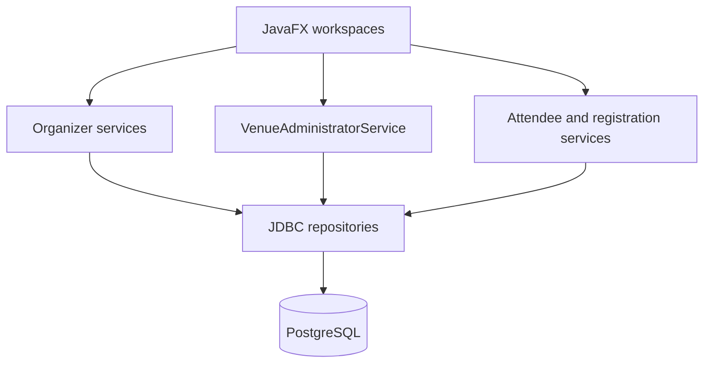
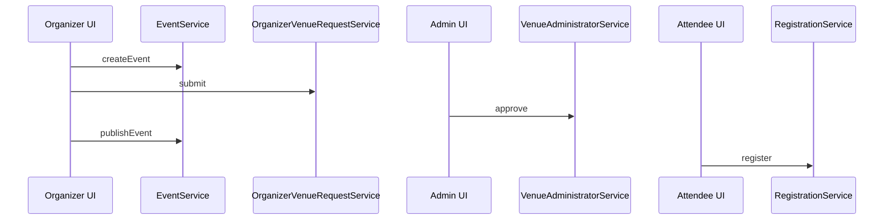

# Orbit Developer Guide

## Acknowledgements

Orbit, an event venue manager, is a CS3227 MP2 team project with three roles: Club Organizer, Venue Administrator, and Attendee.

Libraries:

1. [JavaFX](https://openjfx.io/)
2. [JUnit 5](https://junit.org/junit5/)
3. [PostgreSQL](https://www.postgresql.org/) and JDBC
4. [Flyway](https://flywaydb.org/)
5. [dotenv-java](https://github.com/cdimascio/dotenv-java)
6. Gradle Wrapper

The guide structure follows the team’s earlier AB3-style developer guide: architecture, component notes, then an appendix of user stories, use cases, and non-functional requirements. No MP1 application code was reused. Agentic SE notes live in [`AGENTS.md`](https://github.com/CS3227-2610-MP2-Orbit/CS3227-2610-MP2/blob/HEAD/AGENTS.md) and [Agentic SE](AgenticSE.md).

The product website uses [Jekyll](https://jekyllrb.com/) and
[GitHub Pages](https://docs.github.com/en/pages), with original local HTML/CSS
and the existing Markdown guides. Website maintenance and screenshot provenance
are documented in [WEBSITE.md](https://github.com/CS3227-2610-MP2-Orbit/CS3227-2610-MP2/blob/HEAD/docs/WEBSITE.md).
Documentation diagrams use [Mermaid](https://mermaid.js.org/) (MIT; pinned to
11.12.0 on Pages). The User Guide’s original workflow illustrations use layout
guidance from the [fireworks-tech-graph skill](https://github.com/yizhiyanhua-ai/fireworks-tech-graph).

| Role | Owner | Main code |
| --- | --- | --- |
| Club Organizer | Joseph | `event`, `club`, `volunteer`, `announcement`, Organizer UI |
| Venue Administrator | Jordan | `venue`, `VenueAdministratorService`, Admin UI |
| Attendee | Johannsen | `attendee`, `registration`, Attendee UI |

---

## Setting up, getting started

1. Install JDK 25 and a local PostgreSQL server (tested with PostgreSQL 16 in CI and 17 locally): Postgres.app on macOS, the [EDB installer](https://www.postgresql.org/download/windows/) on Windows, or your distribution’s `postgresql` package on Linux. Create a database named `event_manager` (for example `createdb event_manager`). The configured user should own it, because the first start creates the tables and the `btree_gist` extension. The [User Guide](UserGuide.md#getting-started) has the same steps for testers.
2. Copy [`.env.example`](https://github.com/CS3227-2610-MP2-Orbit/CS3227-2610-MP2/blob/HEAD/.env.example) to a project-root `.env` and fill in your database user, as described in the [User Guide](UserGuide.md#getting-started). All three roles must point at the same database. A fresh database includes the local Venue Administrator `admin` / `admin123` from `V5__development_admin_seed.sql`. That seed does not replace an existing `admin` account, and it is not a production account.
3. From the project root:

   ```sh
   ./gradlew test
   ./gradlew run
   ```

4. Optional: load demo data so every role has something to work with:

   ```sh
   ./gradlew seedDemo
   ```

   `seedDemo` runs `DemoDataSeeder` against the `.env` database. It adds six `demo_*` accounts (password `demo1234`), three clubs, four rooms, published, ongoing, past and draft events, one waiting venue request, registrations, a check-in, a volunteer and an announcement. The same seeder runs from a release jar with `java -jar <jar> --seed-demo`. It never runs automatically. If `demo_organizer` already exists, it changes nothing. The [User Guide](UserGuide.md#trying-the-app-with-demo-data) lists what each account can try.

`EventManagerApplication` checks the database, applies migrations, shows one login screen, and opens the workspace for the account’s role.

---

## Design

### Architecture

The app is one JavaFX process. The UI calls role services. Services enforce ownership and status rules. JDBC repositories persist to PostgreSQL. Domain types do not depend on JavaFX.


```mermaid
flowchart TB
  accTitle: Orbit architecture
  accDescr: JavaFX workspaces call Organizer, Venue Administrator and Attendee services, which use JDBC repositories to access PostgreSQL.
  UI[JavaFX workspaces]
  Org[Organizer services]
  Admin[VenueAdministratorService]
  Att[Attendee and registration services]
  Store[JDBC repositories]
  DB[(PostgreSQL)]

  UI --> Org
  UI --> Admin
  UI --> Att
  Org --> Store
  Admin --> Store
  Att --> Store
  Store --> DB
```

**Main components**

| Component | Responsibility |
| --- | --- |
| UI | Role screens under `seedu.eventmanager.ui`. They collect input and show results. |
| Logic | Services such as `EventService`, `VenueAdministratorService`, and `RegistrationService`. |
| Model | Domain types under `event`, `venue`, `club`, `registration`, `attendee`, and `common`. |
| Storage | JDBC repositories, Flyway migrations, and `DatabaseBootstrap`. |
| Commons | `Actor`, `Role`, exceptions, audit, and logging helpers. |

A shared happy path is: an organizer publishes only after an administrator has approved a matching booking, and an attendee can register only for that published event.


```mermaid
sequenceDiagram
  accTitle: Publishing and registering for an event
  accDescr: The organizer creates an event and submits a venue request. An administrator approves it, then the organizer publishes and the attendee registers.
  participant Org as Organizer UI
  participant ES as EventService
  participant OVS as OrganizerVenueRequestService
  participant Admin as Admin UI
  participant VAS as VenueAdministratorService
  participant Att as Attendee UI
  participant RS as RegistrationService

  Org->>ES: createEvent
  Org->>OVS: submit
  Admin->>VAS: approve
  Org->>ES: publishEvent
  Att->>RS: register
```

### UI component

`seedu.eventmanager.ui`

* `EventManagerApplication` starts the database and routes a session by role.
* `HomeAuthenticationView` logs in, and can create an Attendee or Club Organizer account.
* `OrganizerEventView` is the organizer sidebar: Clubs, Events, Request venue, Registrations, Announcements, Volunteers.
* `VenueAdministratorDashboardView` is the administrator sidebar: Dashboard, Venue requests, Venues, Users and access.
* Attendee screens are `AttendeeBrowseView`, `MyRegistrationsView`, `AttendanceHistoryView`, and the notifications inbox.

The three workspaces share the same shell colours: sidebar `#172033`, page `#f7f9fc`, primary action `#2563eb`.

### Logic component

Services are the API. The UI does not decide whether a draft may be published or whether a seat remains.

**Organizer**

* `ClubService` creates a club for the signed-in organizer. Names are unique ignoring case. There is no rename or delete.
* `EventService` creates, edits, publishes, and soft-deletes events. Only drafts can be edited or deleted. Publishing requires a future start and a confirmed booking at an active venue for the same times.
* Editing capacity updates the expected attendance on an open venue request. Decided requests are left unchanged. Once the latest request is approved, capacity may be lowered but not raised above the approved venue’s capacity; such an edit is rejected and nothing is saved.
* `ClubService` and `EventService` check the live account through `ActiveUserChecker` on every call. A deactivated organizer is refused with `ACCOUNT_INACTIVE`, and their sessions are revoked.
* `OrganizerVenueRequestService` submits a `SUBMITTED` request, or releases an approved booking on a draft.
* `AnnouncementService` posts to registered attendees and can delete an announcement. Already queued notifications are not withdrawn.
* `VolunteerService` assigns a registered attendee, with an optional role of at most 60 characters.
* `RegistrationOverviewService` lists an owned event’s registrants for the organizer.

**Venue Administrator**

* `VenueAdministratorService.approve` and `reject` require an active venue administrator. `JdbcAuthorizationService.requireRole` re-reads the account when the workspace opens and on each approve or reject: an inactive account gets `ACCOUNT_INACTIVE` and its sessions are revoked, and a changed role gets `FORBIDDEN`. Dashboard reloads, **Venues** and **Users and access** do not re-check yet; (see the User Guide’s known issues). Every administrator may decide every request. Only `SUBMITTED` requests can be decided.
* Approve requires the venue to still be `ACTIVE` and the request’s expected attendance not to exceed the venue capacity. It refuses an overlapping confirmed booking, then creates a booking, an audit record, and a notification.
* Reject requires one of two reasons: `Venue already booked` or `Requested capacity exceeds venue capacity`.
* Venue availability can be changed after approval. Deactivating a venue blocks future approvals and active-venue checks for publishing and registration; it does not automatically cancel existing approved bookings.

**Attendee**

* `EventCatalogueService` lists published events that have not ended, with search, club, and Singapore-date filters.
* `RegistrationService` registers, cancels, and checks in the signed-in attendee only. Every attendee service resolves the session token on each call, and a session of an inactive account no longer resolves.
* Cancellation closes when the event starts. A checked-in registration cannot be changed.
* Check-in is open from the start instant inclusive to the end instant exclusive. It needs a confirmed registration, a published event, and a matching confirmed booking at an active venue. It writes an audit record and does not enqueue a notification.
* `MyRegistrationsService`, `AttendanceHistoryService`, and `InboxService` are the read models for the other attendee screens.

### Model component

Important types:

* `Event`, `EventDetails`, `EventStatus` (`DRAFT`, `PUBLISHED`, `DELETED`; `COMPLETED` is defined but no workflow sets it), `OrganizerIdentity`
* `Club`
* `Venue` with `VenueStatus` (`ACTIVE`, `INACTIVE`, `MAINTENANCE`; the UI toggles only between active and inactive), `VenueRequest`, `VenueRequestStatus` (workflows set `SUBMITTED`, `APPROVED`, `REJECTED` and `WITHDRAWN`; `DRAFT`, `INVALID` and `CANCELLED` exist in the schema but no workflow sets them)
* `Registration` (`CONFIRMED`, `CANCELLED`, `CHECKED_IN`)
* `Actor`, `Role` (`CLUB_ORGANIZER`, `VENUE_ADMINISTRATOR`, `ATTENDEE`)

Organizer times are entered in Asia/Singapore and stored as UTC instants.

### Storage component

* Venue-administrator tables are Flyway migrations under `src/main/resources/db/migration`. `DatabaseBootstrap` uses `baselineOnMigrate` so organizer tables can already exist.
* Organizer tables (`db/organizer`) are plain `CREATE TABLE IF NOT EXISTS` scripts run by `DatabaseMigration`, with no schema-history table.
* Registration (`db/registration`) and the attendee inbox (`db/attendee_inbox`) each run their own Flyway configuration with separate history tables (`registration_schema_history`, `attendee_inbox_schema_history`), so they can evolve independently of the venue schema.
* `DatabaseBootstrap` reads `DATABASE_*` and falls back to `EVENT_MANAGER_DB_*`.
* Writes that must succeed or fail together, such as draft deletion with its venue cleanup, go through `TransactionManager`.

### Common classes

`seedu.eventmanager.common` holds `Actor`, `Role`, `AccessDeniedException`, `ValidationException`, `ApplicationException`, and the audit and logging ports. Business audit records are separate from diagnostic logs. Passwords, session tokens, and QR material are not written to those logs. This product does not use QR check-in.

---

## Implementation

### Clubs and events

`ClubService.identityFor` builds the organizer’s `OrganizerIdentity` from clubs that account owns. `EventService.listEvents` returns events for those clubs and hides `DELETED` rows. Create and edit validate a non-blank title, a start before the end, and a positive capacity. A stale version is rejected. After approval, a draft’s times must stay on the booked window unless the organizer releases the venue first.

Publish checks the clock and `EventBookingCheck`. Persisting a publish locks the draft row, then share-locks and re-checks the confirmed booking in that same transaction, so a concurrent venue release cannot leave a published event without a booking. Delete is a soft delete to `DELETED`. The same transaction withdraws a submitted request and releases an approved booking. A published event cannot be deleted.

### Venue requests

`OrganizerVenueRequestService.submit` loads the owned event, requires an `ACTIVE` venue, refuses an open request, and refuses a new request while an approved booking still exists. The request copies the event’s UTC window and uses capacity as expected attendance.

`VenueAdministratorService` decides inside a transaction: authorization, submitted state, active-venue check, capacity check, conflict check on approve, save, booking creation, audit, then a best-effort notification. A notification failure does not roll back the decision. Venue deactivation is an availability control; existing approved bookings are not implicitly cancelled.

### Attendee registration

`RegistrationService` takes the attendee from the live session, not from a caller-supplied user id. Register requires a future published event, a matching confirmed booking at an active venue, and a free seat. Occupied seats include confirmed and checked-in registrations. Cancel is allowed only before the start. An exact retry of a completed change does not write a second audit record. Register and cancel enqueue an in-app notification. Check-in does not.

The catalogue and My Registrations screens call these services. The button label is a preview; the service checks the rules again.

### Notifications inbox

Announcements and registration outcomes are queued in an outbox and delivered into the attendee inbox by a worker that starts with the attendee workspace. The inbox can filter unread and read messages and can mark one or all as read. A deleted announcement remains as the text **Announcement removed.** Delivery is in-app only.

### What is intentionally absent

* Club rename, delete, and multiple owners.
* Withdraw of a still-submitted request. Release applies only to an approved booking on a draft.
* Unpublish, and delete of a published event.
* Password change or password reset.
* Email delivery, waitlist, and QR check-in.
* A per-venue permission split. Every venue administrator has the same access.
* Editing or deactivating an existing Venue Administrator account from **Users and access** (`JdbcUserAccessRepository.updateUser` refuses any save whose role is `VENUE_ADMINISTRATOR`).
* A reconnect screen after login: there is no connection pool or retry, so if PostgreSQL stops responding mid-session each action fails on its own (some Attendee read queries use a 15-second query timeout; other calls wait for the driver).
* Per-user time zones. Singapore time (`Asia/Singapore`) is used for display and date filters, and is declared separately in several classes (`SingaporeDateTimes`, `EventCatalogueService`, `InboxService`, `EventService`, `DemoDataSeeder`) rather than in one shared constant.
* `VenueAvailabilityView` and `VenueUtilizationView` (blocked availability windows and a 30-day utilization report) are built and backed by repositories, but no navigation opens them, so they are not user-facing features.

---

## Documentation, logging, testing, configuration

Update [UserGuide.md](UserGuide.md) and this guide when behaviour changes. Agent task logs stay under `logs/<contributor>/`.

```sh
./gradlew test
```

PostgreSQL integration tests run when their database environment variables are set. A full Gradle run inside a restricted sandbox can exit without executing; that result is not a pass. Manual checks are in the [testing appendix](#appendix-instructions-for-manual-testing).

There is no automated end-to-end desktop test across all three roles. Attendee screens have opt-in JavaFX smoke tasks that open the real views with synthetic services (they need a graphical desktop): `attendeeUiSmoke`, `attendeeRegistrationUiSmoke`, `attendeeCheckInUiSmoke`, `attendeeCheckInAvailabilityUiSmoke`, `attendeeHistoryUiSmoke` and `attendeeInboxUiSmoke`.

**Code style:** `./gradlew checkstyleMain checkstyleTest` applies `config/checkstyle/checkstyle.xml` (and `checkstyle-test.xml` for tests) with zero warnings and zero errors allowed.

**Continuous integration:** `.github/workflows/ci.yml` runs on every push to `main` and every pull request, against a `postgres:16` service. It compiles, runs Checkstyle, then runs the unit, integration, Organizer, Attendee, end-to-end and registration test groups (resetting the database between groups with `reset-ci-database.sh`), and finally `./gradlew build`. Every test step passes `-PfailOnSkippedTests`, so a database test that skips fails the build.

| Variable | Purpose |
| --- | --- |
| `DATABASE_URL` / `EVENT_MANAGER_DB_URL` | JDBC URL |
| `DATABASE_USER` / `EVENT_MANAGER_DB_USER` | Database user |
| `DATABASE_PASSWORD` / `EVENT_MANAGER_DB_PASSWORD` | Optional password |
| `EVENT_MANAGER_LOG_DIR` | Optional diagnostic log folder (process environment only, not `.env`) |
| `DATABASE_INTEGRATION_TESTS` | Set to `true` to run the tests that use the `DATABASE_*` connection (process environment) |
| `EVENT_MANAGER_TEST_DB_URL` / `_USER` / `_PASSWORD` | Disposable PostgreSQL database for the database test suites (process environment). Without them those suites skip; CI sets them and fails on skipped tests |

### Demo data

`seedu.eventmanager.demo.DemoDataSeeder` creates its data through the real services (`ClubService`, `EventService`, `OrganizerVenueRequestService`, `VenueAdministratorService`, `RegistrationService`, `VolunteerService`, `AnnouncementService`). Seeded rows therefore pass the same validation, conflict, publish and registration rules as the app, and they get the normal business audit records. The seeder uses fixed clocks only to place events in the past, present and future relative to the seeding time. It is opt-in (`./gradlew seedDemo` or `--seed-demo`). It is idempotent because it checks for `demo_organizer` first. `DemoDataSeederIntegrationTest` seeds an isolated schema and checks what each role will see.

### Release and deployment (CD)

`.github/workflows/release.yml` builds and checks one jar for all supported systems:

1. **Build** (Ubuntu): `./gradlew test releaseJar`. Database suites skip there; the CI workflow runs them against PostgreSQL.
2. **Verify** on Ubuntu, Windows and macOS runners: the same jar runs `--version` and `--check-javafx`. `--check-javafx` starts and stops the JavaFX toolkit, which proves that the OS’s native libraries load. Linux uses a virtual display (`xvfb-run`).
3. **Publish** (only for a `v*` tag or a manual run): a GitHub Release with the jar, `SHA256SUMS.txt`, and `env.example` (a copy of `.env.example`, because dot-files are awkward to download).

Pull requests that change `build.gradle`, `src/main` or the workflow run steps 1–2 only, so every change is checked on all three systems before a release.

`releaseJar` builds `build/release/Orbit-<version>.jar`. It holds the app, all runtime dependencies, and JavaFX for Windows (`win`), Linux (`linux`) and Apple Silicon macOS (`mac-aarch64`). The per-OS native libraries have different names (`.dll`, `.so`, `.dylib`), so they coexist in one jar. The Intel macOS libraries use the same names as the Apple Silicon ones, so Intel Macs are not supported by the jar. Each platform’s JavaFX jars come from their own Gradle configuration, because Gradle rejects two platform variants of one module in a single configuration. `mergeServiceFiles` merges the `META-INF/services` files of all dependencies. Without it, Flyway would keep only one copy and lose its PostgreSQL plugin inside the jar. The manifest sets `Main-Class` and `Enable-Native-Access: ALL-UNNAMED`.

The release version comes from `version` in `build.gradle`: it names the jar and is written to the manifest, and `--version` reads it from there (running from source prints `development`). The publish step refuses a tag that does not match the jar, so bump `version` before releasing.

To release, merge to the default branch, then either open **Actions → Release → Run workflow** and enter a version such as `v1.0.0` (the workflow creates the tag), or run `git tag v1.0.0 && git push origin v1.0.0`. Releases are deliberately manual, so an unfinished merge never becomes the latest release.

### Monitoring and diagnostics

This is local diagnostics for a desktop app, not a hosted monitoring or alerting service.

| Part | Where | What it does |
| --- | --- | --- |
| Diagnostic log | `DiagnosticLog` | Sends all `java.util.logging` output to a rotating file (`app-0.log`, 5 × 1 MB) in `~/.orbit/logs`, or in `EVENT_MANAGER_LOG_DIR`. Uncaught exceptions on any thread are logged as `uncaught_exception`. |
| Structured events | `StructuredLogger` | One-line `event=… key=value` records: `app_started`, `database_health`, `database_unavailable`, `database_not_configured`, `database_migration_failed`, `login_succeeded` (role only), `login_failed` (exception type only), `workspace_failed`, `app_stopped`, and the Venue Administrator decision events. |
| Metrics | `InMemoryMetrics` via `Monitoring.metrics()` | Thread-safe counters and gauges, for example `app.login_succeeded.<role>`, `app.login_failed`, `app.database_unavailable`, `database.latency_ms`, and the Venue Administrator `venue_requests.*` counters. They replace `NoopMetrics` as the default in `VenueAdministratorServiceFactory`. The snapshot is written to the log in `app_stopped`. |
| Health check | `DatabaseHealth` | Before migrations, connects with a 5-second timeout and runs `SELECT 1`. The login screen shows the result and the log path. On failure, the error screen shows a safe cause (derived from the SQL state), the current folder and a **Try again** button. |

The app’s own log events never include passwords, session tokens, connection strings or usernames. Exceptions from libraries are logged with their original message and stack trace, and those can include a JDBC URL (never the password). Business audit records (who approved, published, registered or checked in) stay in the database audit tables and are separate from the diagnostic log.

---

## Appendix: Requirements

### Target users and value

**Target users:** a student club organizer, a campus venue administrator, and a student attendee.

**Value:** one desktop app and one database, so a draft can become an approved booking and then a published event that attendees can join.

### User stories

| Priority | As a… | I want to… | So that… |
| --- | --- | --- | --- |
| High | new user | create an Attendee or Organizer account and log in | I reach the right workspace |
| High | organizer | create a club | my events belong to me |
| High | organizer | create and edit a draft event | I can plan before anyone else sees it |
| High | organizer | request a room | an administrator can approve it |
| High | organizer | publish an approved future draft | attendees can find it |
| High | administrator | approve or reject a waiting request | the room is booked or refused for a clear reason |
| High | administrator | create and deactivate rooms | organizers can request only available rooms |
| High | attendee | search published events | I can find one I can attend |
| High | attendee | register and cancel before the start | I can manage my own seat |
| High | attendee | check in during the event | my attendance is recorded |
| Medium | organizer | see registrations, send announcements, and assign volunteers | I can run the event |
| Medium | attendee | read notifications and attendance history | I can see what changed and where I checked in |
| Medium | administrator | create accounts and turn them on or off | I can control who can sign in |
| Low | organizer | delete a draft | I can drop a plan and free its room |

### Use cases

**UC01 — Create an account and sign in**

**MSS**

1. User chooses **Create normal user account**.
2. System offers Attendee or Club Organizer.
3. User enters a username and a password of at least 8 characters.
4. System stores the account and asks the user to log in.
5. User logs in.
6. System opens that role’s workspace.

**Extensions**

* 2a. The user wants a Venue Administrator account. An existing administrator creates it in **Users and access** instead.
* 3a. The username is taken or the password is too short. System shows the error and does not sign the user in.

**UC02 — Create a club and a draft event**

**MSS**

1. Organizer opens **Clubs** and enters a name.
2. System saves the club for that account.
3. Organizer opens **Events**, chooses **+ New event**, fills the form, and saves.
4. System stores a draft owned by that club.

**Extensions**

* 1a. The name is blank, longer than 80 characters, or already used ignoring case. System rejects it.
* 3a. The organizer has no club, the title is blank, the end is not after the start, or the capacity is not positive. System rejects the save.

**UC03 — Request, decide, and publish**

**MSS**

1. Organizer submits a request for an owned event and an active room.
2. System stores a waiting request.
3. Administrator approves it.
4. System stores a booking and removes the request from the waiting list.
5. Organizer publishes the draft before it starts.
6. System marks the event published, and attendees can browse it.

**Extensions**

* 1a. A request is already open, or an approved booking still exists. System rejects the submit.
* 3a. Administrator rejects with one of the two supported reasons. No booking is created. Use case ends.
* 3b. The room is already booked for an overlapping time. System refuses approval.
* 5a. The event is not a draft, has already started, or has no matching confirmed booking at an active room. System refuses publish.

**UC04 — Register and cancel**

**MSS**

1. Attendee searches **Browse events** and selects a future published event.
2. Attendee selects **Register**.
3. System confirms the seat and later shows a notification in **Notifications**.
4. Before the start, attendee cancels from **Browse events** or **My Registrations**.
5. System marks that registration cancelled.

**Extensions**

* 2a. The event has started, is full, or has no matching active booking. System rejects registration.
* 4a. The event has started, or the attendee is already checked in. System rejects cancellation.
* 5a. The event is still open and a seat remains. Attendee selects **Re-register**. Cancelling did not keep the seat.

**UC04b — Check in**

**MSS**

1. Attendee has a confirmed registration for a published event with a matching active booking.
2. During the event, from the start instant inclusive until the end instant exclusive, attendee selects **Check in**.
3. System records the check-in time. **Attendance history** shows it. No inbox message is created.

**Extensions**

* 2a. It is before the start or at or after the end, the registration is cancelled or missing, or the booking is no longer valid. System rejects check-in.
* 2b. The attendee is already checked in. System does not write a second check-in or change the original time.

**UC05 — Announce and assign a volunteer**

**MSS**

1. Organizer selects an owned event under **Announcements** and sends a message.
2. System stores the announcement and queues a notification for each current registrant.
3. Organizer selects **Volunteers**, chooses a registered attendee, and assigns an optional role.
4. System stores one volunteer assignment.

**Extensions**

* 1a. The message is blank or longer than 1000 characters. System rejects it.
* 2a. The organizer later deletes the announcement. People who already received it see **Announcement removed.**
* 3a. The person is not registered, or is already a volunteer. System rejects the assignment.

### Non-functional requirements

1. The desktop UI runs on JDK 25 with JavaFX. One release jar runs on Windows, Linux and Apple Silicon macOS where JDK 25 and PostgreSQL are installed. Intel macOS runs from the source code.
2. Events, bookings, registrations, and the inbox are stored in PostgreSQL, not in a local JSON file.
3. Authorization is enforced in services. Hiding a button is not the only check. An attendee acts only as the signed-in account. A deactivated account loses access on its next checked action, not only at its next login; the administrator screens that do not re-check yet are listed in the User Guide’s known issues.
4. A failed decision or registration does not leave a partial booking or a second check-in. Related writes share a transaction.
5. Error text shown on a role screen names the problem in plain language. If the database is not configured or cannot be reached at startup, the app shows a plain-language cause, the current folder, the diagnostic log path and a **Try again** button. It does not show the password or the full connection string.
6. Diagnostic logs go to a rotating local file and must not contain passwords, session tokens, or unnecessary personal data. Business audit records stay in the database, separate from diagnostic logs.
7. The three role screens share one visual shell so a user can move between them without learning a new layout.
8. Automated tests cover service rules and PostgreSQL integrations, and CI fails if a database test is skipped. A person still has to click through JavaFX before a screen is called done. No performance target for thousands of rows is claimed.
9. A release is published only after the same jar has started JavaFX on Linux, Windows and macOS in the release workflow.

---

## Appendix: Instructions for manual testing

These steps are a starting point. Exploratory testing should go beyond them. Use one shared database.

### Launch

1. Start PostgreSQL and `./gradlew run`. For a quick start, run `./gradlew seedDemo` first and use the `demo_*` accounts.
2. Create an Attendee and a Club Organizer from the login screen. Create a Venue Administrator from **Users and access**.
3. Each login opens a different sidebar. **Home** or **Log out** returns to the shared login screen. Expected: you can log in as another role without restarting.

### Organizer

1. Create a club, then a draft. Expected: the draft is listed and is not in the attendee catalogue.
2. Submit a venue request. Expected: the administrator’s waiting list shows it.
3. After approval, publish. Expected: the attendee catalogue shows it. Edit and Delete are refused.
4. On a different draft, approve a room, then try to change the times. Expected: the save is refused until **Release venue**.

### Administrator

1. Create a room, then toggle it unavailable. Expected: the organizer cannot request it.
2. Approve a waiting request. Expected: it leaves the waiting list.
3. Submit a second request that overlaps that booking. Expected: approval is refused.
4. Reject another request with each of the two reasons. Expected: a blank or other reason is refused.

### Attendee

1. Register for a future published event. Expected: My Registrations shows it, and a notification arrives after a refresh.
2. Cancel before the start, then try again after the start on another event. Expected: only the first cancel works.
3. At the start time, check in. Expected: Attendance history shows that check-in. Cancel is refused.

---

## Appendix: Planned enhancements

* Rename and delete clubs.
* Withdraw a request that is still waiting.
* Password change in a separate audited flow.
* Email delivery.
* Automated JavaFX checks for resize, labels, and primary buttons.
* Wire the venue availability and utilization screens into the administrator sidebar, or remove them.
* Re-check the live account on every administrator screen, not only on approve and reject.
* Count dashboard room availability by booking time instead of by any confirmed booking.

**Implemented now:** shared login; organizer clubs, drafts, requests, release, publish, draft delete, registrations, announcements, and volunteers; administrator rooms, decisions, and accounts; attendee browse, register, cancel, check-in, history, and inbox.
