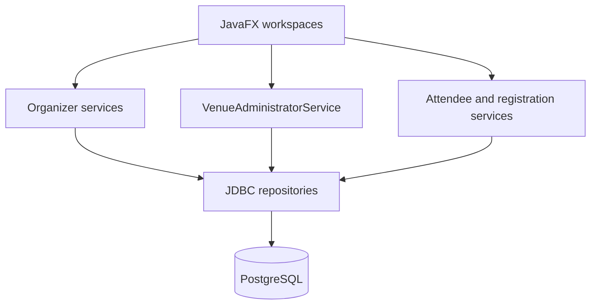
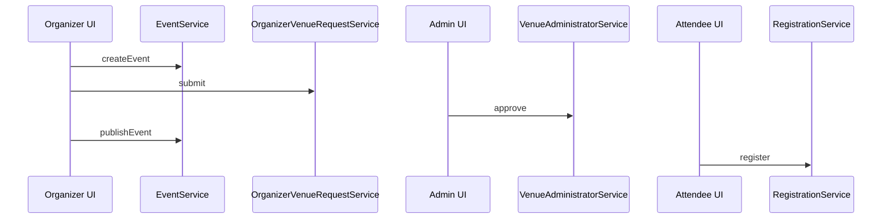

# Event Venue Manager Developer Guide

## Acknowledgements

Event Venue Manager is a CS3227 MP2 team project with three roles: Club Organizer, Venue Administrator, and Attendee.

Libraries:

1. [JavaFX](https://openjfx.io/)
2. [JUnit 5](https://junit.org/junit5/)
3. [PostgreSQL](https://www.postgresql.org/) and JDBC
4. [Flyway](https://flywaydb.org/)
5. [dotenv-java](https://github.com/cdimascio/dotenv-java)
6. Gradle Wrapper

The guide structure follows the team’s earlier AB3-style developer guide: architecture, component notes, then an appendix of user stories, use cases, and non-functional requirements. No MP1 application code was reused. Agentic SE notes live in [`AGENTS.md`](../AGENTS.md) and [Agentic SE](AgenticSE.md).

| Role | Owner | Main code |
| --- | --- | --- |
| Club Organizer | Joseph | `event`, `club`, `volunteer`, `announcement`, Organizer UI |
| Venue Administrator | Jordan | `venue`, `VenueAdministratorService`, Admin UI |
| Attendee | Johannsen | `attendee`, `registration`, Attendee UI |

---

## Setting up, getting started

1. Install JDK 25 and a local PostgreSQL server. Create a database named `event_manager`.
2. Copy [`.env.example`](../.env.example) to a project-root `.env` and fill in your database user, as described in the [User Guide](UserGuide.md#getting-started). All three roles must point at the same database. A fresh database includes the local Venue Administrator `admin` / `admin123` from `V5__development_admin_seed.sql`. That seed does not replace an existing `admin` account, and it is not a production account.
3. From the project root:

   ```sh
   ./gradlew test
   ./gradlew run
   ```

4. Optional: load demo data so every role has something to work with:

   ```sh
   ./gradlew seedDemo
   ```

   `seedDemo` runs `DemoDataSeeder` against the `.env` database. It adds six `demo_*` accounts (password `demo1234`), three clubs, four rooms, published, ongoing, past and draft events, one waiting venue request, registrations, a check-in, a volunteer and an announcement. The same seeder runs from a release jar with `java -jar <jar> --seed-demo`. It never runs automatically. If `demo_organizer` already exists, it changes nothing. The [User Guide](UserGuide.md#trying-the-app-with-demo-data) lists what each account can try.

`EventManagerApplication` checks the database, applies migrations, shows one login screen, and opens the workspace for the account’s role.

---

## Design

### Architecture

The app is one JavaFX process. The UI calls role services. Services enforce ownership and status rules. JDBC repositories persist to PostgreSQL. Domain types do not depend on JavaFX.


```mermaid
flowchart TB
  UI[JavaFX workspaces]
  Org[Organizer services]
  Admin[VenueAdministratorService]
  Att[Attendee and registration services]
  Store[JDBC repositories]
  DB[(PostgreSQL)]

  UI --> Org
  UI --> Admin
  UI --> Att
  Org --> Store
  Admin --> Store
  Att --> Store
  Store --> DB
```

**Main components**

| Component | Responsibility |
| --- | --- |
| UI | Role screens under `seedu.eventmanager.ui`. They collect input and show results. |
| Logic | Services such as `EventService`, `VenueAdministratorService`, and `RegistrationService`. |
| Model | Domain types under `event`, `venue`, `club`, `registration`, `attendee`, and `common`. |
| Storage | JDBC repositories, Flyway migrations, and `DatabaseBootstrap`. |
| Commons | `Actor`, `Role`, exceptions, audit, and logging helpers. |

A shared happy path is: an organizer publishes only after an administrator has approved a matching booking, and an attendee can register only for that published event.


```mermaid
sequenceDiagram
  participant Org as Organizer UI
  participant ES as EventService
  participant OVS as OrganizerVenueRequestService
  participant Admin as Admin UI
  participant VAS as VenueAdministratorService
  participant Att as Attendee UI
  participant RS as RegistrationService

  Org->>ES: createEvent
  Org->>OVS: submit
  Admin->>VAS: approve
  Org->>ES: publishEvent
  Att->>RS: register
```

### UI component

`seedu.eventmanager.ui`

* `EventManagerApplication` starts the database and routes a session by role.
* `HomeAuthenticationView` logs in, and can create an Attendee or Club Organizer account.
* `OrganizerEventView` is the organizer sidebar: Clubs, Events, Request venue, Registrations, Announcements, Volunteers.
* `VenueAdministratorDashboardView` is the administrator sidebar: Dashboard, Venue requests, Venues, Users and access.
* Attendee screens are `AttendeeBrowseView`, `MyRegistrationsView`, `AttendanceHistoryView`, and the notifications inbox.

The three workspaces share the same shell colours: sidebar `#172033`, page `#f7f9fc`, primary action `#2563eb`.

### Logic component

Services are the API. The UI does not decide whether a draft may be published or whether a seat remains.

**Organizer**

* `ClubService` creates a club for the signed-in organizer. Names are unique ignoring case. There is no rename or delete.
* `EventService` creates, edits, publishes, and soft-deletes events. Only drafts can be edited or deleted. Publishing requires a future start and a confirmed booking at an active venue for the same times.
* Editing capacity updates the expected attendance on an open venue request. Decided requests are left unchanged.
* `OrganizerVenueRequestService` submits a `SUBMITTED` request, or releases an approved booking on a draft.
* `AnnouncementService` posts to registered attendees and can delete an announcement. Already queued notifications are not withdrawn.
* `VolunteerService` assigns a registered attendee, with an optional role of at most 60 characters.
* `RegistrationOverviewService` lists an owned event’s registrants for the organizer.

**Venue Administrator**

* `VenueAdministratorService.approve` and `reject` require an active venue administrator. Every administrator may decide every request. Only `SUBMITTED` requests can be decided.
* Approve refuses an overlapping confirmed booking, then creates a booking, an audit record, and a notification.
* Reject requires one of two reasons: `Venue already booked` or `Requested capacity exceeds venue capacity`.

**Attendee**

* `EventCatalogueService` lists published events that have not ended, with search, club, and Singapore-date filters.
* `RegistrationService` registers, cancels, and checks in the signed-in attendee only.
* Cancellation closes when the event starts. A checked-in registration cannot be changed.
* Check-in is open from the start instant inclusive to the end instant exclusive. It needs a confirmed registration, a published event, and a matching confirmed booking at an active venue. It writes an audit record and does not enqueue a notification.
* `MyRegistrationsService`, `AttendanceHistoryService`, and `InboxService` are the read models for the other attendee screens.

### Model component

Important types:

* `Event`, `EventDetails`, `EventStatus` (`DRAFT`, `PUBLISHED`, `DELETED`), `OrganizerIdentity`
* `Club`
* `Venue`, `VenueRequest`, `VenueRequestStatus` (`SUBMITTED`, `APPROVED`, `REJECTED`)
* `Registration` (`CONFIRMED`, `CANCELLED`, `CHECKED_IN`)
* `Actor`, `Role` (`CLUB_ORGANIZER`, `VENUE_ADMINISTRATOR`, `ATTENDEE`)

Organizer times are entered in Asia/Singapore and stored as UTC instants.

### Storage component

* Venue-administrator tables are Flyway migrations under `src/main/resources/db/migration`. `DatabaseBootstrap` uses `baselineOnMigrate` so organizer tables can already exist.
* Organizer, registration, and inbox tables are applied by their own startup migrations.
* `DatabaseBootstrap` reads `DATABASE_*` and falls back to `EVENT_MANAGER_DB_*`.
* Writes that must succeed or fail together, such as draft deletion with its venue cleanup, go through `TransactionManager`.

### Common classes

`seedu.eventmanager.common` holds `Actor`, `Role`, `AccessDeniedException`, `ValidationException`, `ApplicationException`, and the audit and logging ports. Business audit records are separate from diagnostic logs. Passwords, session tokens, and QR material are not written to those logs. This product does not use QR check-in.

---

## Implementation

### Clubs and events

`ClubService.identityFor` builds the organizer’s `OrganizerIdentity` from clubs that account owns. `EventService.listEvents` returns events for those clubs and hides `DELETED` rows. Create and edit validate a non-blank title, a start before the end, and a positive capacity. A stale version is rejected. After approval, a draft’s times must stay on the booked window unless the organizer releases the venue first.

Publish checks the clock and `EventBookingCheck`. Delete is a soft delete to `DELETED`. The same transaction withdraws a submitted request and releases an approved booking. A published event cannot be deleted.

### Venue requests

`OrganizerVenueRequestService.submit` loads the owned event, requires an `ACTIVE` venue, refuses an open request, and refuses a new request while an approved booking still exists. The request copies the event’s UTC window and uses capacity as expected attendance.

`VenueAdministratorService` decides inside a transaction: authorization, submitted state, conflict check on approve, save, booking creation, audit, then a best-effort notification. A notification failure does not roll back the decision.

### Attendee registration

`RegistrationService` takes the attendee from the live session, not from a caller-supplied user id. Register requires a future published event, a matching confirmed booking at an active venue, and a free seat. Occupied seats include confirmed and checked-in registrations. Cancel is allowed only before the start. An exact retry of a completed change does not write a second audit record. Register and cancel enqueue an in-app notification. Check-in does not.

The catalogue and My Registrations screens call these services. The button label is a preview; the service checks the rules again.

### Notifications inbox

Announcements and registration outcomes are queued in an outbox and delivered into the attendee inbox by a worker that starts with the attendee workspace. The inbox can filter unread and read messages and can mark one or all as read. A deleted announcement remains as the text **Announcement removed.** Delivery is in-app only.

### What is intentionally absent

* Club rename, delete, and multiple owners.
* Withdraw of a still-submitted request. Release applies only to an approved booking on a draft.
* Unpublish, and delete of a published event.
* Password change or password reset.
* Email delivery, waitlist, and QR check-in.
* A per-venue permission split. Every venue administrator has the same access.

---

## Documentation, logging, testing, configuration

Update [UserGuide.md](UserGuide.md) and this guide when behaviour changes. Agent task logs stay under `logs/<contributor>/`.

```sh
./gradlew test
```

PostgreSQL integration tests run when their database environment variables are set. A full Gradle run inside a restricted sandbox can exit without executing; that result is not a pass. JavaFX behaviour is not covered by an automated end-to-end desktop test. Manual checks are in the [testing appendix](#appendix-instructions-for-manual-testing).

| Variable | Purpose |
| --- | --- |
| `DATABASE_URL` / `EVENT_MANAGER_DB_URL` | JDBC URL |
| `DATABASE_USER` / `EVENT_MANAGER_DB_USER` | Database user |
| `DATABASE_PASSWORD` / `EVENT_MANAGER_DB_PASSWORD` | Optional password |
| `EVENT_MANAGER_LOG_DIR` | Optional diagnostic log folder (process environment only, not `.env`) |

### Demo data

`seedu.eventmanager.demo.DemoDataSeeder` creates its data through the real services (`ClubService`, `EventService`, `OrganizerVenueRequestService`, `VenueAdministratorService`, `RegistrationService`, `VolunteerService`, `AnnouncementService`). Seeded rows therefore pass the same validation, conflict, publish and registration rules as the app, and they get the normal business audit records. The seeder uses fixed clocks only to place events in the past, present and future relative to the seeding time. It is opt-in (`./gradlew seedDemo` or `--seed-demo`). It is idempotent because it checks for `demo_organizer` first. `DemoDataSeederIntegrationTest` seeds an isolated schema and checks what each role will see.

### Release and deployment (CD)

`.github/workflows/release.yml` runs when a `v*` tag is pushed (or manually for an existing tag):

1. It runs `./gradlew test`. Database suites skip there; the CI workflow runs them against PostgreSQL.
2. On Ubuntu, Windows and macOS runners, it builds `./gradlew releaseJar` and smoke-starts each jar with `java -jar … --version` on its own OS.
3. It publishes a GitHub Release with the three jars, `SHA256SUMS.txt`, and `env.example` (a copy of `.env.example`, because dot-files are awkward to download).

`releaseJar` builds `build/release/EventVenueManager-<version>-<os>-<arch>.jar`: the app, all runtime dependencies, and the JavaFX native libraries of the OS that builds it. JavaFX natives are platform-specific (and the Intel and Apple Silicon macOS libraries share file names), so there is one jar per OS rather than one universal jar. There is no Intel macOS jar. `mergeServiceFiles` merges the `META-INF/services` files of all dependencies before packaging. Without it, Flyway would keep only one copy and lose its PostgreSQL plugin inside the jar. The manifest sets `Main-Class` and `Enable-Native-Access: ALL-UNNAMED`.

To release: merge to the default branch, then `git tag v1.0.0 && git push origin v1.0.0`.

### Monitoring and diagnostics

This is local diagnostics for a desktop app, not a hosted monitoring or alerting service.

| Part | Where | What it does |
| --- | --- | --- |
| Diagnostic log | `DiagnosticLog` | Sends all `java.util.logging` output to a rotating file (`app-0.log`, 5 × 1 MB) in `~/.event-venue-manager/logs`, or in `EVENT_MANAGER_LOG_DIR`. Uncaught exceptions on any thread are logged as `uncaught_exception`. |
| Structured events | `StructuredLogger` | One-line `event=… key=value` records: `app_started`, `database_health`, `database_unavailable`, `database_not_configured`, `database_migration_failed`, `login_succeeded` (role only), `login_failed` (exception type only), `workspace_failed`, `app_stopped`, and the Venue Administrator decision events. |
| Metrics | `InMemoryMetrics` via `Monitoring.metrics()` | Thread-safe counters and gauges, for example `app.login_succeeded.<role>`, `app.login_failed`, `app.database_unavailable`, `database.latency_ms`, and the Venue Administrator `venue_requests.*` counters. They replace `NoopMetrics` as the default in `VenueAdministratorServiceFactory`. The snapshot is written to the log in `app_stopped`. |
| Health check | `DatabaseHealth` | Before migrations, connects with a 5-second timeout and runs `SELECT 1`. The login screen shows the result and the log path. On failure, the error screen shows a safe cause (derived from the SQL state), the current folder and a **Try again** button. |

The app’s own log events never include passwords, session tokens, connection strings or usernames. Exceptions from libraries are logged with their original message and stack trace, and those can include a JDBC URL (never the password). Business audit records (who approved, published, registered or checked in) stay in the database audit tables and are separate from the diagnostic log.

---

## Appendix: Requirements

### Target users and value

**Target users:** a student club organizer, a campus venue administrator, and a student attendee.

**Value:** one desktop app and one database, so a draft can become an approved booking and then a published event that attendees can join.

### User stories

| Priority | As a… | I want to… | So that… |
| --- | --- | --- | --- |
| High | new user | create an Attendee or Organizer account and log in | I reach the right workspace |
| High | organizer | create a club | my events belong to me |
| High | organizer | create and edit a draft event | I can plan before anyone else sees it |
| High | organizer | request a room | an administrator can approve it |
| High | organizer | publish an approved future draft | attendees can find it |
| High | administrator | approve or reject a waiting request | the room is booked or refused for a clear reason |
| High | administrator | create and deactivate rooms | organizers can request only available rooms |
| High | attendee | search published events | I can find one I can attend |
| High | attendee | register and cancel before the start | I can manage my own seat |
| High | attendee | check in during the event | my attendance is recorded |
| Medium | organizer | see registrations, send announcements, and assign volunteers | I can run the event |
| Medium | attendee | read notifications and attendance history | I can see what changed and where I checked in |
| Medium | administrator | create accounts and turn them on or off | I can control who can sign in |
| Low | organizer | delete a draft | I can drop a plan and free its room |

### Use cases

**UC01 — Create an account and sign in**

**MSS**

1. User chooses **Create normal user account**.
2. System offers Attendee or Club Organizer.
3. User enters a username and a password of at least 8 characters.
4. System stores the account and asks the user to log in.
5. User logs in.
6. System opens that role’s workspace.

**Extensions**

* 2a. The user wants a Venue Administrator account. An existing administrator creates it in **Users and access** instead.
* 3a. The username is taken or the password is too short. System shows the error and does not sign the user in.

**UC02 — Create a club and a draft event**

**MSS**

1. Organizer opens **Clubs** and enters a name.
2. System saves the club for that account.
3. Organizer opens **Events**, chooses **+ New event**, fills the form, and saves.
4. System stores a draft owned by that club.

**Extensions**

* 1a. The name is blank, longer than 80 characters, or already used ignoring case. System rejects it.
* 3a. The organizer has no club, the title is blank, the end is not after the start, or the capacity is not positive. System rejects the save.

**UC03 — Request, decide, and publish**

**MSS**

1. Organizer submits a request for an owned event and an active room.
2. System stores a waiting request.
3. Administrator approves it.
4. System stores a booking and removes the request from the waiting list.
5. Organizer publishes the draft before it starts.
6. System marks the event published, and attendees can browse it.

**Extensions**

* 1a. A request is already open, or an approved booking still exists. System rejects the submit.
* 3a. Administrator rejects with one of the two supported reasons. No booking is created. Use case ends.
* 3b. The room is already booked for an overlapping time. System refuses approval.
* 5a. The event is not a draft, has already started, or has no matching confirmed booking at an active room. System refuses publish.

**UC04 — Register, cancel, and check in**

**MSS**

1. Attendee searches **Browse events** and selects a published event.
2. Attendee selects **Register**.
3. System confirms the seat and later shows a notification.
4. Before the start, attendee cancels.
5. During the event, attendee checks in.
6. System records the check-in time. **Attendance history** shows it.

**Extensions**

* 2a. The event has started, is full, or has no matching active booking. System rejects registration.
* 4a. The event has started, or the attendee is already checked in. System rejects cancellation.
* 5a. It is before the start or at or after the end, or the booking is no longer valid. System rejects check-in and does not write a second check-in.

**UC05 — Announce and assign a volunteer**

**MSS**

1. Organizer selects an owned event under **Announcements** and sends a message.
2. System stores the announcement and queues a notification for each current registrant.
3. Organizer selects **Volunteers**, chooses a registered attendee, and assigns an optional role.
4. System stores one volunteer assignment.

**Extensions**

* 1a. The message is blank or longer than 1000 characters. System rejects it.
* 3a. The person is not registered, or is already a volunteer. System rejects the assignment.
* 2a. The organizer later deletes the announcement. People who already received it see **Announcement removed.**

### Non-functional requirements

1. The desktop UI runs on JDK 25 with JavaFX. The same project runs on macOS, Windows, and Linux where JDK 25 and PostgreSQL are installed.
2. Events, bookings, registrations, and the inbox are stored in PostgreSQL, not in a local JSON file.
3. Authorization is enforced in services. Hiding a button is not the only check. An attendee acts only as the signed-in account.
4. A failed decision or registration does not leave a partial booking or a second check-in. Related writes share a transaction.
5. Error text shown to users names the problem in plain language. Database exception text is not shown on the attendee workspace.
6. Diagnostic logs must not contain passwords, session tokens, or unnecessary personal data.
7. The three role screens share one visual shell so a user can move between them without learning a new layout.
8. Automated tests cover service rules and PostgreSQL integrations. A person still has to click through JavaFX before a screen is called done. No performance target for thousands of rows is claimed.

---

## Appendix: Instructions for manual testing

These steps are a starting point. Exploratory testing should go beyond them. Use one shared database.

### Launch

1. Start PostgreSQL and `./gradlew run`. For a quick start, run `./gradlew seedDemo` first and use the `demo_*` accounts.
2. Create an Attendee and a Club Organizer from the login screen. Create a Venue Administrator from **Users and access**.
3. Each login opens a different sidebar. **Home** or **Log out** returns to login.

### Organizer

1. Create a club, then a draft. Expected: the draft is listed and is not in the attendee catalogue.
2. Submit a venue request. Expected: the administrator’s waiting list shows it.
3. After approval, publish. Expected: the attendee catalogue shows it. Edit and Delete are refused.
4. On a different draft, approve a room, then try to change the times. Expected: the save is refused until **Release venue**.

### Administrator

1. Create a room, then toggle it unavailable. Expected: the organizer cannot request it.
2. Approve a waiting request. Expected: it leaves the waiting list.
3. Submit a second request that overlaps that booking. Expected: approval is refused.
4. Reject another request with each of the two reasons. Expected: a blank or other reason is refused.

### Attendee

1. Register for a future published event. Expected: My Registrations shows it, and a notification arrives after a refresh.
2. Cancel before the start, then try again after the start on another event. Expected: only the first cancel works.
3. At the start time, check in. Expected: Attendance history shows that check-in. Cancel is refused.

---

## Appendix: Planned enhancements

* Rename and delete clubs.
* Withdraw a request that is still waiting.
* Password change in a separate audited flow.
* Email delivery.
* Automated JavaFX checks for resize, labels, and primary buttons.

**Implemented now:** shared login; organizer clubs, drafts, requests, release, publish, draft delete, registrations, announcements, and volunteers; administrator rooms, decisions, and accounts; attendee browse, register, cancel, check-in, history, and inbox.
