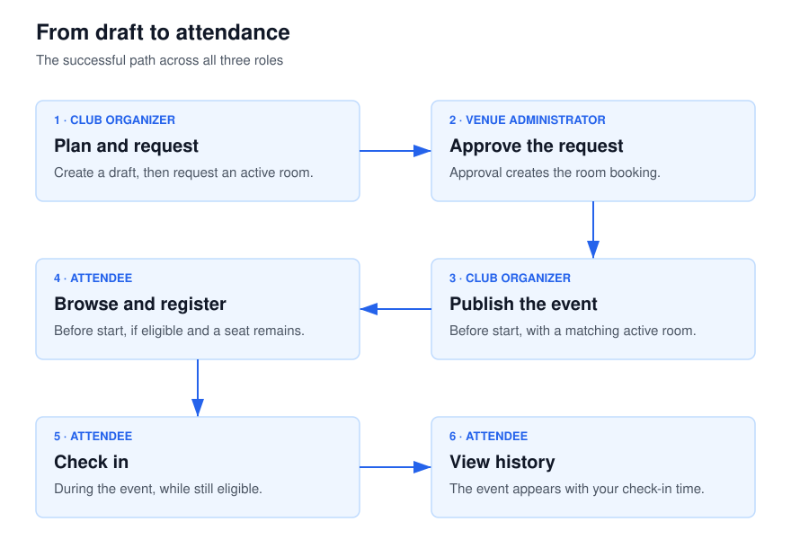
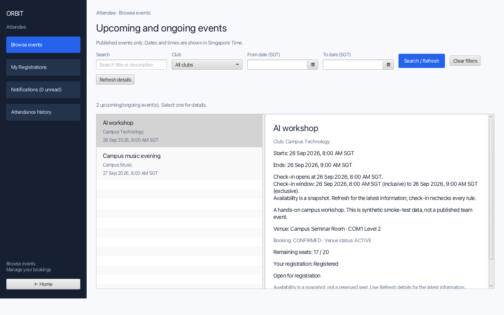
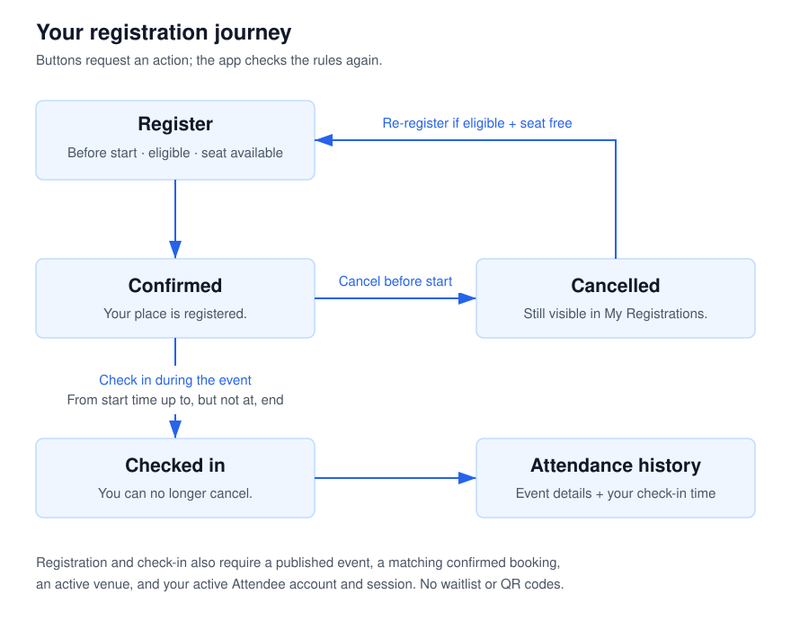
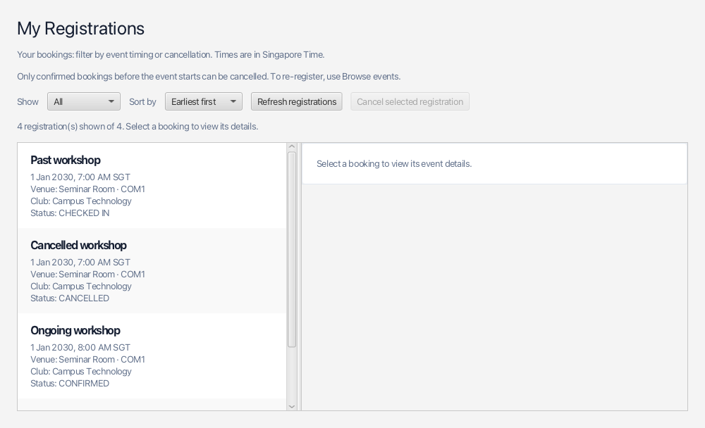
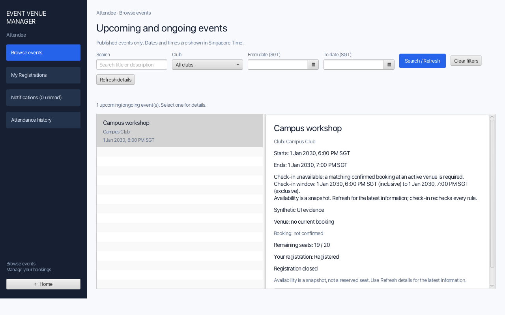
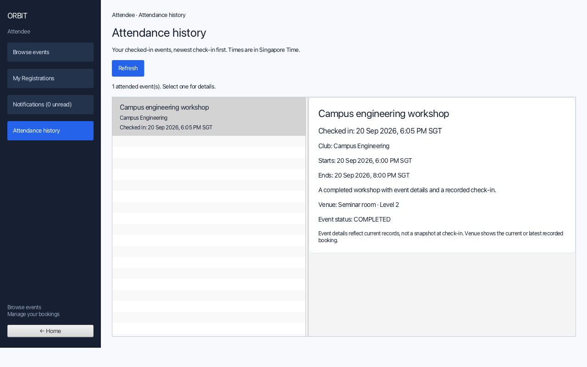
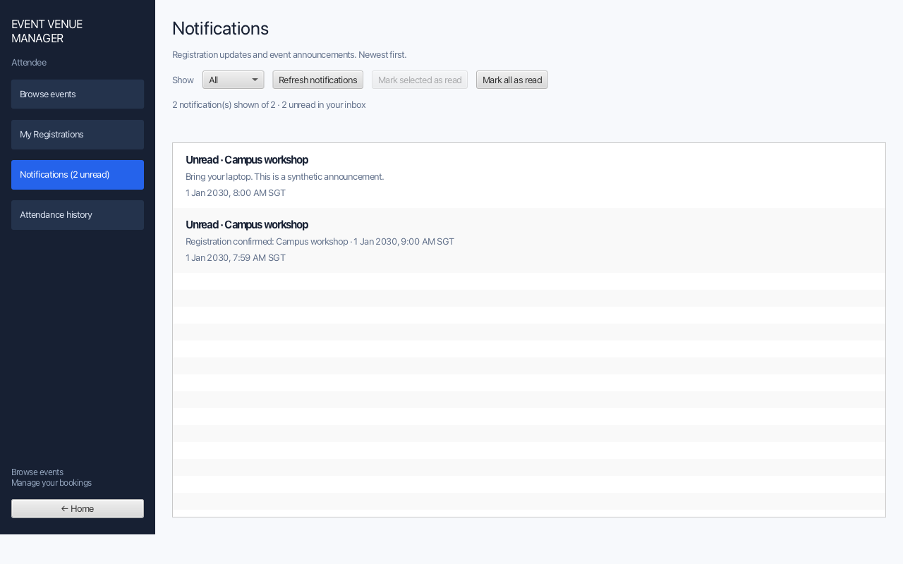

# Event Venue Manager User Guide

Event Venue Manager is a desktop app for campus events. Three kinds of people use it:

* A **club organizer** plans a club’s events, asks for a room, and tells registered students what is happening.
* A **venue administrator** looks after rooms and says yes or no to booking requests.
* An **attendee** browses published events, signs up, checks in, and reads messages.

You click through a window. You do not type commands. Everyone signs in on the same screen, and the app opens the workspace that matches the account.

> **Tip:** Unfamiliar words are listed in the [Glossary](#glossary).

---

## How to use this guide

1. [Getting started](#getting-started) — install what you need, then open the app.
2. [Feature summary](#feature-summary) — a short list of what each person can do.
3. [Features](#features) — how to do each task, one role at a time.
4. [FAQ](#faq) — common problems.
5. [Known issues](#known-issues) — things the app does not do yet.

> **Note:** Extra context for the step you are on.

> **Tip:** A shortcut or easier way.

> **Caution:** A mistake that will stop the action.

---

## Getting started

1. Install **JDK 25**. In a terminal, `java -version` should mention version 25.
2. Install and start **PostgreSQL** (on a Mac, [Postgres.app](https://postgresapp.com/) is enough). Create a database named `event_manager` if you do not already have one.
3. In the project folder, create a file named `.env`. Use your own database username:

   ```env
   DATABASE_URL=jdbc:postgresql://localhost:5432/event_manager
   DATABASE_USER=your_postgres_username
   EVENT_MANAGER_DB_URL=jdbc:postgresql://localhost:5432/event_manager
   EVENT_MANAGER_DB_USER=your_postgres_username
   ```

   Add `DATABASE_PASSWORD` and `EVENT_MANAGER_DB_PASSWORD` only if your database asks for a password.

4. From the project folder, start the app:

   ```sh
   ./gradlew run
   ```

   On Windows: `.\gradlew.bat run`

5. On the login screen you can **log in**, or choose **Create normal user account** to make an Attendee or Club Organizer account. The password must be at least 8 characters. A fresh database already includes a local Venue Administrator: username `admin`, password `admin123`. That account is for trying the app on your own computer. More administrator accounts are created later under **Users and access**.

> **Caution:** Restart the app after you change `.env`. All three roles must use the same database, or an organizer’s request will not show up for the administrator.

> **Note:** A brand-new database has no events. Attendees see an empty list until an organizer publishes one.

---

## Feature summary

**Anyone**, on the login screen: sign in, or create an Attendee or Club Organizer account.

**Club Organizer**

* **Clubs** — create a club
* **Events** — create, edit, publish, or delete a draft event
* **Request venue** — ask for a room, or give an approved room back
* **Registrations** — see who signed up
* **Announcements** — send or delete an announcement
* **Volunteers** — add or remove a volunteer

**Venue Administrator**

* **Dashboard** — see pending requests and rooms
* **Venue requests** — approve or reject a request
* **Venues** — add or change a room
* **Users and access** — add or change accounts

**Attendee**

* **Browse events** — search published events and sign up
* **My Registrations** — see or cancel your own bookings
* **Browse events** or **My Registrations** — check in while an event is happening
* **Attendance history** — see events you already attended
* **Notifications** — read updates

---

## Features

### Signing in

1. Type your username and password, then select **Log in**.
2. The app opens Club Organizer, Venue Administrator, or Attendee, depending on the account.
3. **← Home** or **Log out** returns you to the login screen.

To make your own Attendee or Club Organizer account, select **Create normal user account**, pick the role, then enter a username and a password of at least 8 characters. You still need to log in afterwards.

> **Note:** You cannot create a Venue Administrator account from this screen. An existing administrator does that under **Users and access**.

---

## Club Organizer

You only see the clubs you created, and the events that belong to those clubs.

The flow below shows how the three roles work together on a successful event.
Approval alone does not put an event in the attendee catalogue: the organizer
must still **Publish** it. The steps below explain the requirements and rejections.

[](assets/images/event-workflow.png)

*Select the diagram for a full-size PNG.*

### Creating a club

1. Select **Clubs**.
2. Type a **Club name** (up to 80 characters) and select **Create club**.

The club appears under **Your clubs** and in the club list when you create an event.

> **Caution:** Names must be unique even if the letters differ only by case. `Chess Club` and `chess club` cannot both exist. You cannot rename or delete a club yet. The person who creates the club is its only owner.

### Creating a draft event

A draft is a plan. Attendees cannot see it until you publish it.

1. Create a club first if you do not have one.
2. Select **Events**, then **+ New event**.
3. Choose a **Club**, enter a **Title**, an optional **Description**, a start and end in Singapore time (for example `18:00`), and a **Capacity** greater than zero.
4. Select **Save event**.

The event appears in **Your events**. A new form starts with `18:00`–`20:00` and capacity `80`. You can change those before saving.

### Editing a draft

1. Select **Events**, then the event.
2. Change the fields and select **Save event**.
3. **Reset** clears a new form. **Revert changes** puts an existing draft back to the last saved version.

Only drafts can be edited. If the event was saved again after you opened it, your save is refused and you should select the event again.

Changing **Capacity** also updates the attendance number on a request that is still waiting. A request that has already been approved or rejected is left as it was.

> **Caution:** After a room is approved, the start and end times are locked to that booking. Title, description, and capacity can still change. To change the times, [release the room](#releasing-an-approved-room) first.

### Requesting a room

1. Ask an administrator to create an active room first, if none exist.
2. Select **Request venue**.
3. Choose your event and an active room, then select **Submit request**.

You see a success message, and the request status changes to waiting. The administrator sees the same request in **Venue requests**.

You cannot submit a second request while one is still open, and you cannot submit another while an approved booking is still held. The event must be yours.

### Releasing an approved room

Use this when a draft needs a different time or a different room.

1. Select **Request venue**.
2. Select the draft that already has an approved room.
3. Select **Release venue**, then **OK**.

The booking is given up. You can edit the times and submit a new request. A published event keeps its room.

### Publishing an event

Publishing is what makes the event visible to attendees.

1. The event must still be a draft.
2. It must start in the future.
3. It must have an approved booking at an active room for the same start and end.
4. Select the event, select **Publish**, then **OK**.

After that, attendees can find it under **Browse events**. You can no longer edit or delete it. If the approved booking is released at the same moment, publish is refused and the event stays a draft.

### Deleting a draft

1. Select **Events**, then a draft.
2. Select **Delete**, then **OK**.

The event disappears from your list. A waiting request is withdrawn, and an approved booking is released. Published events cannot be deleted. There is no undo.

### Viewing registrations

1. Select **Registrations**.
2. Select an event.

You see who is signed up, including people who have checked in, with the event’s capacity. An event with nobody signed up shows an empty list. You only see events you own.

### Announcements

1. Select **Announcements**, then an event.
2. Write a message (up to 1000 characters) and select **Send announcement**.
3. To remove one, select it and select **Delete selected**, then **OK**.

Registered attendees receive the message in **Notifications** after a short wait. If nobody is registered yet, the announcement is still saved and nobody is notified. Deleting the announcement does not pull back a message that was already sent. Those attendees later see **Announcement removed.**

### Volunteers

1. Select **Volunteers**, then an event.
2. Choose a registered attendee, optionally type a **Role** such as `Usher` (up to 60 characters), and select **Assign volunteer**.
3. To remove someone, select them and select **Remove selected**.

Only people who are registered for that event can be volunteers. The same person cannot be added twice. If nobody is registered, the list says so.

---

## Venue Administrator

### Dashboard

**Dashboard** shows how many requests are waiting and how many rooms are available. **Refresh** reloads those numbers. The sidebar also has **Venue requests**, **Venues**, **Users and access**, and **Log out**.

### Rooms

1. Select **Venues**, then **Create venue**.
2. Enter a name, a location, and a capacity greater than zero.

The room starts as available. Select a room and **Edit selected** to change its details. **Toggle availability** switches it between available and unavailable. Unavailable rooms cannot be requested for new bookings. An old booking does not turn the whole room off forever; the room can be used again after that booking’s time has passed.

Changing a room to unavailable is allowed even when it has previously approved requests. It prevents new requests from being approved and prevents future event publishing or attendee registration that requires an active venue. Existing approved bookings are not automatically cancelled by this toggle.

### Reviewing requests

1. Select **Venue requests**. The list loads when you open the page.
2. Select a waiting request.
3. Select **Approve**, or **Reject** and choose a reason.

The reasons are **Venue already booked** and **Requested capacity exceeds venue capacity**.

An approved request becomes a booking and leaves the waiting list. A rejected request also leaves the waiting list. Approving fails if that room is already booked for an overlapping time or is no longer active. Every venue administrator can review every request.

The table shows a short reference, the room, the event title, the organizer’s username, the start time, and the expected attendance.

### Users and access

1. Select **Users and access**.
2. **Create user** asks for a username, a password of at least 8 characters, and a role: Attendee, Club Organizer, or Venue Administrator.
3. **Edit account** changes the username, the role, and whether the account is active.

There is no change-password screen yet. Deactivating an account stops that person from using it.

---

## Attendee

### Browsing events

1. Log in with an Attendee account. **Browse events** opens.
2. Type words to search titles and descriptions. Matching ignores capital letters.
3. Optionally pick a club. **All clubs** is the default.
4. Optionally set **From date** and **To date**. These are the event’s start date in Singapore time. Either box can be left empty. From must not be later than To.
5. Select **Search / Refresh**. **Clear filters** resets everything and reloads the list.
6. Select an event to see its title, description, club, times, room, seats left, and whether you are signed up. **Refresh details** reloads that event.

The list shows published events that have not ended, soonest first. Full events stay visible, with an explanation of why you cannot sign up. An event that has already started shows **Registration closed**. Drafts never appear.

[](assets/images/attendee-browse.png)

*Real application screen with synthetic test data and a controlled clock. Select the image to view it full-size.*

> **Note:** Seats count people who are signed up or checked in, including inactive accounts that were not cancelled. Your seat is not held while you are only looking. The app checks again when you press the button.

### Signing up, cancelling, and signing up again

1. Select an event and select **Register** when the button is there.
2. You can register only yourself. There is no waiting list.
3. **Cancel registration** works only before the event starts, and only for your own confirmed booking.
4. After you cancel, **Re-register** appears when the event is still open and a seat remains. Cancelling does not keep the seat for you.

You cannot register after the event has started, without a confirmed room, or when the event is full. If your record changed while you were looking at it, refresh and try again.

[](assets/images/registration-workflow.png)

*Check-in still requires a published event and a matching confirmed booking at an active venue. Select the diagram for a full-size PNG.*

### My registrations

Select **My Registrations**. You see only your own bookings.

**Show** filters **All**, **Upcoming**, **Ongoing**, **Past**, or **Cancelled**. **Sort by** orders them by start time. Select a booking to see its details beside the list. Drag the divider to make either side wider.

**Cancel selected registration** cancels a future confirmed booking and keeps your filter. To sign up again, go back to **Browse events**. **Refresh registrations** picks up changes made elsewhere.

Check-in for an event that is happening now is on this screen as well. Events you never joined do not appear here.

[](assets/images/attendee-registration-filters.png)

*Real My Registrations screen rendered in isolation with synthetic test data; the workspace sidebar is not shown in this capture. Select a booking to open its details beside the list. Select the image to view it full-size.*

### Checking in

1. Open the event in **Browse events**, or open its booking in **My Registrations**.
2. Select **Check in** while the event is happening.

Check-in opens at the start time and closes at the end time. There is no early window, no late window, and no QR code. You must already be signed up, the event must still be published, and the room booking must still be in place. After you check in, you cannot cancel.

The details panel explains why the button is missing, for example “too early”, “already checked in”, or “cancelled”. Those words describe what was loaded. Select **Refresh details** or **Refresh registrations** if time has moved on. Checking in does not send you a new notification.

[](assets/images/attendee-check-in-availability.png)

*Real application screen with synthetic test data and a controlled clock. This example intentionally has no confirmed booking, so check-in is unavailable even during the event. Select the image to view it full-size.*

### Attendance history

Select **Attendance history**. Only events you have checked into are listed, newest check-in first. Events you skipped are not here. Select a row to see the event and the time you checked in. This page is view-only. **Refresh** reloads it.

[](assets/images/attendance-history.png)

*Real application screen with synthetic test data. Select the image to view it full-size.*

### Notifications

Select **Notifications** to read registration confirmations, cancellations, and announcements. The newest message is first. A badge shows how many are unread.

* **Refresh notifications** reloads the list. Opening the page also reloads it. It does not keep checking in the background.
* **Show** can limit the list to **All**, **Unread**, or **Read**.
* **Mark selected as read** marks one message. **Mark all as read** marks every message, including ones hidden by the filter.
* Read and unread status is remembered after you close the app.

Messages can take a few seconds to arrive after you register or after an organizer sends an announcement. Then refresh. This is inside the app, not email. If an announcement is deleted, you may still see **Announcement removed.**

[](assets/images/attendee-notifications.png)

*Real application screen with synthetic test data. Select the image to view it full-size.*

---

## FAQ

**Q: Request venue has no rooms.**  
A: An administrator needs to create an available room under **Venues**. Then open **Request venue** again.

**Q: I submitted a request and the administrator cannot see it.**  
A: Both people must be using the same database. Open **Venue requests** again so the list reloads, and check that your submit showed a success message.

**Q: Approve says the room is already taken.**  
A: Another booking overlaps that time. Reject this request, or approve a request for a different time.

**Q: Where do I add a club?**  
A: Log in as a Club Organizer and use **Clubs** → **Create club**.

**Q: My old events disappeared.**  
A: Events created under the old demo setup are still stored, but no account owns those clubs, so they are hidden. Create a club and new events with your account.

**Q: Can I change my password?**  
A: Not yet. An administrator can deactivate an account or create a new one.

**Q: Why is Browse events empty?**  
A: Only published events appear. A draft stays invisible until the organizer publishes it.

---

## Known issues

* An organizer cannot withdraw a request that is still waiting. They can release a room only after it has been approved, and only while the event is still a draft.
* Clubs cannot be renamed or deleted.
* There is no email. Messages stay inside **Notifications**.
* The unread count updates when you open or refresh **Notifications**, not continuously.
* Published events cannot be unpublished or deleted.
* Check-in records that you said you attended. It does not prove you were physically in the room.

---

## Glossary

| Term | Meaning |
| --- | --- |
| Draft | An organizer’s event that attendees cannot see yet |
| Published | An event attendees can browse and, when it is still in the future, sign up for |
| Request | An organizer’s ask for a room, waiting for an administrator |
| Booking | A room that an administrator has approved for an event |
| Capacity | How many people the event can take |
| Check-in | An attendee marking themselves present while the event is happening |

---

## Acknowledgements

Libraries and team notes are in the [Developer Guide](DeveloperGuide.md#acknowledgements).
